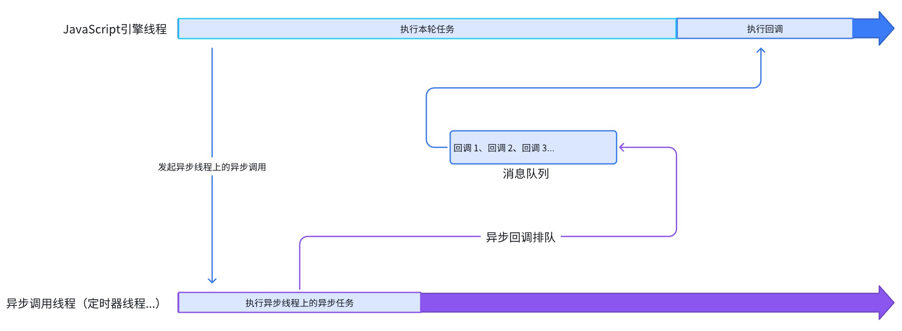
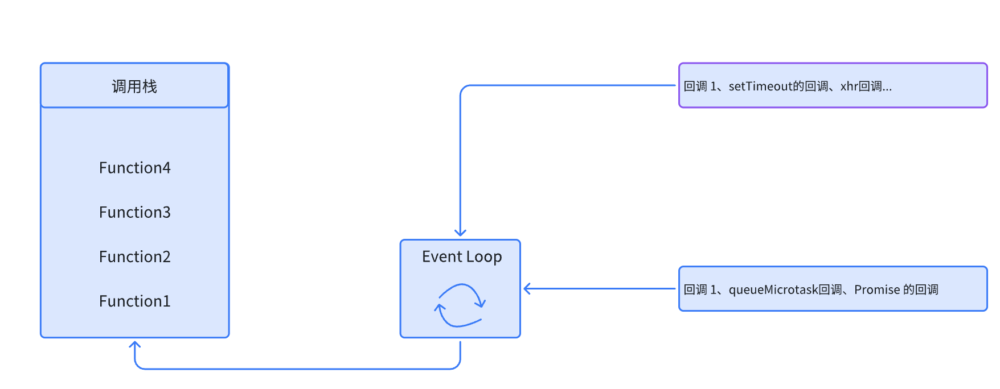

# 深入浅出：JavaScript异步编程详解以及模拟实现事件循环机制
## 1.前言
Javascript 由最初的设计初衷，设计为单线程模式，单线程模式指的是在 JS执行环境中只有一个线程去执行代码，那如果遇到耗时任务，就会导致代码执行堵塞，那js为了解决这种等待耗时任务结束才能继续执行下一个任务代码的问题，js 将执行任务的模式分成了两种，一种是同步模式，一种是异步模式，下面就会重点讲解异步模式。
## 2.同步模式和异步模式
### 2.1 同步模式
同步模式指的是前一个任务执行完成，下一个任务才开始执行，按照编写代码的调用顺序依次执行
### 2.2 异步模式
异步模式指的是不会等待前一个任务执行结束，就会立即执行下一个任务。其中在异步任务中，任务又分为宏任务和微任务


1. **宏任务**

- 宏任务是优先级比较低的任务，耗时比较长或由浏览器参与操作的任务。每次事件循环只会执行一个宏任务，在执行完一个宏任务，会立即清空当前所有的微任务，再继续执行下一个宏任务。

- 常见宏任务的类型：`setTimeout` 等定时器的回调、
`XMLHttpRequest`等网络请求的的回调、`DOM`事件的回调

2. **微任务**

 - 微任务是优先级比较高的任务，需要快速立即执行的任务。微任务在当前宏任务执行完毕后会立即清空，即使再此期间产生新的微任务，会加入当前微任务的队列的尾部，与所有的微任务一起执行，不会推迟到下一个宏任务。

 - 微任务是由 javascript 引擎发起和执行的，javascript 引擎与浏览器渲染线程是互斥的，所以在执行微任务期间，在浏览器运行环境中，页面不会发生渲染。

 - 常见微任务的类型：`Promsie`的回调、`await`关键字后面的代码、`queueMicrotask`的回调、`process.nextTick`NOdeJs环境，优先级高于其微任务

## 3.事件循环的理解
### 3.1 事件循环机制的概念
事件循环机制是 javascript实现异步编程的核心机制，由于 javascript 是单线程，它实现了非阻塞的异步行为，它是由调用栈、消息队列、宏任务和微任务组成。事件循环工作流程是：
- 将主程序（同步代码）压入调用栈并立即执行，执行完毕会立即弹出栈
- 遇到异步任务，宏任务加入宏任务队列、微任务加入微任务队列
- 当调用栈为空时，先清空微任务队列中的所有任务（取出微任务队列中的回调压入调用栈并立即执行，执行完毕会立即弹出栈），即使再此期间产生新的微任务，会加入当前微任务的队列的尾部，与所有的微任务一起执行，不会推迟到下一个宏任务
- 在根据宏任务优先级执行下一个宏任务（取出宏任务队列中的回调压入调用栈并立即执行，执行完毕会立即弹出栈）
- 继续重复以上流程



### 3.2 模拟事件循环机制
```
class EventLoop{
  
  // 定义调用栈、微任务、宏任务、执行状态
  constructor() {
    // 调用栈 - 执行同步代码
    this.callStack = this.createObservableArray('调用栈');

    // 微任务 - 存放 Promsie.then的回调、queueMicrotask的回调等
    this.microQueue = []

    // 宏任务 - 存放 setTimeout的回调等
    this.macroQueue = []

    // 是否 正在执行中
    this.running = false
  }

  // 执行同步代码
  executeSyncCode(name,func) {

    console.log(`\n执行同步代码: ${name}`);

    this.callStack.push(name)

    func(this)

    this.callStack.pop()

    console.log(`完成同步代码: ${name}`);

    // 同步代码执行完毕后，处理事件循环
    this.processEventLoop()
 
  }

  // 添加微任务
  pushMicroTask(name,func) {
    this.microQueue.push({name,func})
  }

  // 添加宏任务
  pushMacroTask(name,func) {
    this.macroQueue.push({name,func})
  }

  // 执行事件循环
  processEventLoop() {

    if(this.running) return

    this.running = true
    console.log("\n=== 开始事件循环 ===");

    // 处理所有微任务
    while(this.microQueue.length) {

      const microTask = this.microQueue.shift()

      // 压入调用栈
      this.callStack.push(microTask.name)

      // 执行
      microTask.func(this)

      // 弹出调用栈
      this.callStack.pop()
    }

    // 处理一个宏任务
    if(this.macroQueue.length) {

      const macroTask = this.macroQueue.shift() 

      // 压入调用栈
      this.callStack.push(macroTask.name)

      // 执行
      macroTask.func(this)

      // 弹出调用栈
      this.callStack.pop()

      // 一个宏任务执行完后可能产生新的微任务，需要再次处理或者需要继续执行下一个宏任务
      this.running = false

      this.processEventLoop()

    } else {

      console.log("\n=== 事件循环结束 ===");
      this.running  = false

    }

  }

  // 创建可观察的数组，使用Proxy监听变化
  createObservableArray(name) {
    const array = [];
    
    // 保存原始的push和pop方法
    const originalPush = array.push;
    const originalPop = array.pop;
    
    return new Proxy(array, {
      // 监听属性访问
      get(target, prop, receiver) {
        // 对于push和pop方法，我们需要重写
        if (prop === 'push') {
          return function(...args) {
            console.log(`\n[${name}变化] 准备添加元素:`, args);
            const result = originalPush.apply(target, args);
            console.log(`[${name}变化] 添加后:`, [...target]);
            return result;
          };
        }
        
        if (prop === 'pop') {
          return function() {
            console.log(`\n[${name}变化] 准备移除元素`);
            const popped = originalPop.apply(target);
            console.log(`[${name}变化] 移除了: ${popped}, 剩余:`, [...target]);
            return popped;
          };
        }
        
        // 其他属性和方法正常访问
        return Reflect.get(target, prop, receiver);
      },
      
      // 监听属性设置
      set(target, prop, value, receiver) {
        // 处理直接设置索引的情况，如array[0] = 'value'
        if (!isNaN(Number(prop))) {
          console.log(`\n[${name}变化] 设置索引${prop}为:`, value);
        }
        return Reflect.set(target, prop, value, receiver);
      }
    });
  }
}

```
### 3.3 对模拟事件循环机制进行测试验证
```
// 测试事件循环
 function testEventLoop() {
    
  const eventLoop = new EventLoop();
  
  // 执行主脚本（同步代码）
  eventLoop.executeSyncCode("主脚本", (el) => {

    // 主脚本中创建一个Promise（微任务）
    el.pushMicroTask("Promise.then 1", (el) => {
      console.log("执行第一个Promise的回调");
      // 在微任务中创建另一个微任务
      el.pushMicroTask("Promise.then 2", () => {
        console.log("执行第二个Promise的回调");
      });
      // 在微任务中创建一个宏任务
      el.pushMacroTask("setTimeout 2", () => {
        console.log("执行第二个setTimeout的回调");
      });
    });
    
    // 主脚本中创建一个setTimeout（宏任务）
    el.pushMacroTask("setTimeout 1", (el) => {
      console.log("执行第一个setTimeout的回调");
      // 在宏任务中创建一个微任务
      el.pushMicroTask("Promise.then 3", () => {
        console.log("执行第三个Promise的回调");
      });
    });
    
    // 主脚本中的同步代码
    console.log("这是主脚本中的同步代码");
  });
}

// 运行测试
testEventLoop();
```
## 4.实现异步编程的几种方法 
- 回调函数：是所有异步编程方案的根基，缺点是多个回调函数嵌套造成回调地域的问题
- Promise：是一种更优的异步编程的统一方案，Promise就是为了解决这个多个回调函数嵌套调用造成的问题，Promise 的支持链式调用。
- Generator：虽然 Promise支持链式调用的写法了，但是 Generator支持同步代码写法
- async/await：是Generator和 Promise 函数的结合之后的语法糖，结合了 Promise是可靠性，也同样跟Generator函数一样支持同步代码线性写法


## 5. 总结
这篇文章主要讲解了javascript 引擎是单线程的，为解决单线程执行代码阻塞问题，提出异步编程，使用事件循环机制使得异步任务高效有条理运行。后面根据异步编程又有主流这四种实现方案，各个方案都有自己的优缺点和适用场景。下面的文章开始Promise、Generator、async/await的详解，以及手撕代码