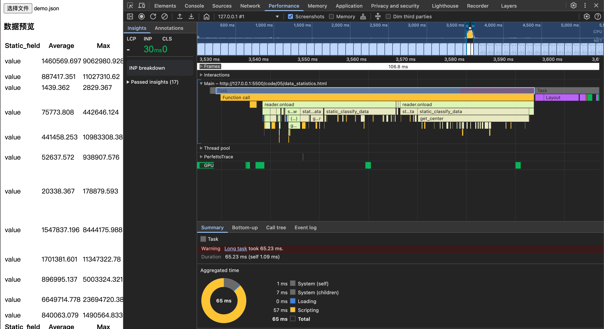
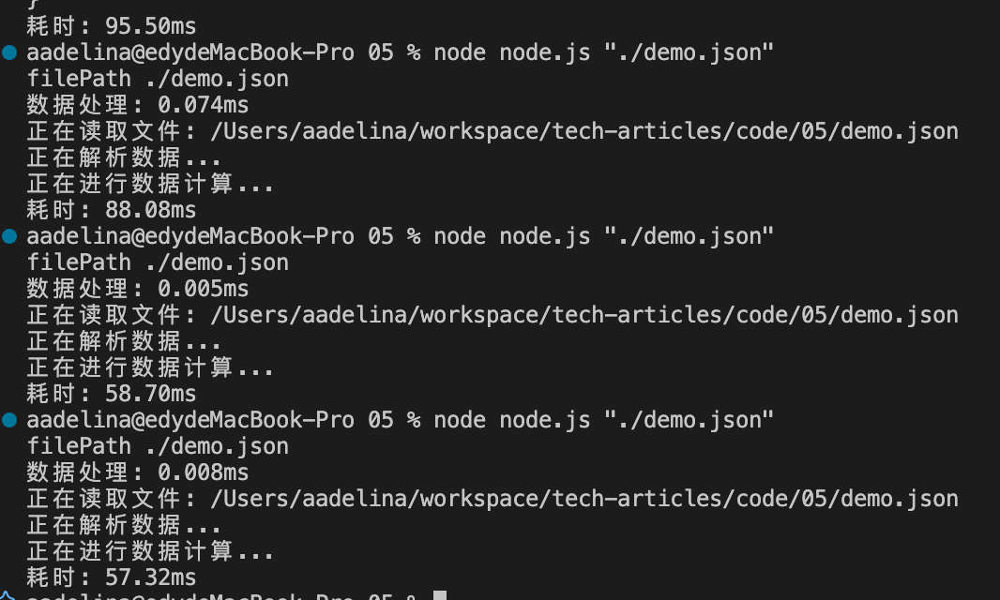

# 千量数据级别的数据统计分析渲染
## 1.前言
噔楞，一个消息，这个数据按照以下要求统计渲染下，跟老板开会汇报用。不知道领导从哪里搞来的这么多数据，要的还挺急，咋办，整呗！
## 2.需求
先看下领导给的数据：
-  数据结构：
```
{
    nodes: [
        ...
        {
            id: "44",
            sim_name: "BHS",
            name: "Bahamas",
            region: "Caribbean and Central America",
            resource: "Cereals",
            year: 2012,
            value: 427.395,
            weight: 969.33
        }
        ...
    ],
    edges:[
        ...
        {
            "eid": "e16",
            "source": "4",
            "sourceSimName": "AFG",
            "sourceRegion": "Afghanistan",
            "sourceName": "South Asia",
            "target": "56",
            "targetSimName": "BEL",
            "targetName": "Belgium",
            "targetRegion": "Europe",
            "resource": "Maize",
            "year": "2015",
            "value": "9.049",
            "weight": "11.52",
            "embodiedLand": "4.765",
            "embodiedWater": "348.756"
        },
        ......
    ]
}
```

- 统计要求：
    - 在 nodes 数据组中，按 region 分组，计算出每一类 region 下 value 平均值、最大值、最小值、中位值、总和
    - 在 nodes 数据组中，按 region 分组，计算每一年，每一类 region 下 value 平均值、最大值、最小值、中位值、总和
    - 在 edges 数据组中，按 resource 分类，计算每一类 resource 下 value 平均值、最大值、最小值、中位值、总和
    - 在整个数据集中，找到weight的最大值、最小值、中位值
## 3.分析需求
- 按照要求可以使用`Map`进行分类,易于查找
- 需要统计出数据的平均值、最大值、最小值、中位值、总和，需要初始化一个存储结构
- 然后循环遍历取值求结果，尽量时间复杂度控制在 O(n)

统计操作数据应该不是很难的，主要是意识到千级别的数据量咔咔处理完数据，再去进行一下性能分析，看看有没有需要优化的点，开干！

## 4.码代码
### 4.1 按组统计的，定义好参数和返回值
对于前三个统计信息，可以封装成一个方法实现，
- 参数:数据源、按照哪个字段进行统计、需要的分类字段
- 返回值： 分类好的 map
```
/*
* 数据进行分类完进行统计
* @params 
* data  json对象数组原数据
* static_field 字符串 对某一个字段全部统计
* args: 各类分类字段 一级分类字段 region、resource.....、二级分类字段 year、month.....、三级....
* @return map
*/
const static_classify_data = (data,static_field,...args) => {
    //Todo...
}

```
### 4.2 ⭐️重点动态实现多层级分组
核心思想就是若一级分类下没有数据，则创建一个新的 map,若二级分类下没有数据，则继续创建...直到最后一个分类数据下存储统计数据的最大值、最小值...等
```
const static_classify_data = (data,static_field,...args) => {
    
    const map = new Map()

    for(let i = 0; i < data.length; i++) {


        let j = 0,temp_map = map,level = j + 1 //读取到分类的层级

        //动态遍历分类字段，确保每层分类上都具备数据
        while(j < args.length && (!temp_map.get(data[i][args[j]]) || level < args.length)){

            // 查找每一分类层级是不是具备数据，有的话继续查找并更新 temp_map
            if(temp_map.get(data[i][args[j]]) && level < args.length){

                temp_map = temp_map.get(data[i][args[j]])

                j = level++

                continue
            }

            // 最后一个分类层级需要初始统计数据结构result_data()
            if(j === args.length - 1) {

                temp_map.set(data[i][args[j]],result_data())

                break
            }

            // 每一分类层级不具备数据，则需要初始一个 map
            temp_map.set(data[i][args[j]],new Map())

            temp_map = temp_map.get(data[i][args[j]])

            j++
        }

        const last_param = args[args.length - 1]

        //获取最后一个分类层级下的数据，是result_data()结构
        const cur_map = temp_map.get(data[i][last_param])

        //对数据进行数字转型
        const value = data[i][static_field]? parseFloat(data[i][static_field]):0

        //对数据进行保留 3 位小数处理
        const value_float3 =  keep_float(value,3)
    
        //存储数据
        cur_map.values.push(value_float3)
    
        // 最大值
        cur_map.max = Math.max(cur_map.max,value_float3)
    
        // 最小值
        cur_map.min = Math.min(cur_map.min, value_float3)
    
        // 总和
        cur_map.sum += value_float3

        cur_map.sum = keep_float(cur_map.sum,3)

        // 中位数
        cur_map.center = keep_float(get_center(cur_map.values),3)

        // 平均值
        cur_map.average = keep_float(cur_map.sum / cur_map.values.length,3)

        cur_map.static_field = static_field

        args.forEach((item,index) => {
            cur_map[item] = data[i][item]
        })
    
    }

    return map
}
```

### 4.3 整个数据集按照字段进行统计
实现时注意时间复杂度尽量降级到 O(n)
```
/*
* 全部数据进行统计
* @params 
* data  json对象数组原数据
* static_field 字符串 对某一个字段全部统计
* @return map
*/

const static_data = (data,static_field) => {

    // 判断数据类型
    if(!Array.isArray(data)) {

        console.error('JSON文件内容必须是一个对象数组');

        return;
    }

    const result = result_data()

    for(let i = 0; i < data.length; i++) {

        const value = data[i][static_field]? parseFloat(data[i][static_field]):0

        const value_float3 =  keep_float(value,3)

        result.values.push(value_float3)

        // 最大值
        result.max = Math.max(result.max,value_float3)

        // 最小值
        result.min = Math.min(result.min,value_float3)

        // 总和
        result.sum += value_float3

        result.sum = keep_float(result.sum,3)
    }
    // 中位数
    result.center = keep_float(get_center(result.values),3)

    // 平均值
    result.average = keep_float(result.sum / result.values.length,3)

    result.static_field = static_field

    return result
}
```
### 4.4 完整代码

以下是 js的端代码，完整代码在仓库可自行下载，代码仓库还具备 node端的实现方式
```

/*
* 数据进行分类完进行统计
* @params 
* data  json对象数组原数据
* static_field 字符串 对某一个字段全部统计
* args: 各类分类字段 一级分类字段 region、resource.....、二级分类字段 year、month.....、三级....
* @return map
*/
const static_classify_data = (data,static_field,...args) => {

    // 判断数据类型
    if(!Array.isArray(data)) {
        console.error('JSON文件内容必须是一个对象数组');
        return;
    }
    const map = new Map()

    for(let i = 0; i < data.length; i++) {

        let j = 0,temp_map = map,level = j + 1

        while(j < args.length && (!temp_map.get(data[i][args[j]]) || level < args.length)){

            if(temp_map.get(data[i][args[j]]) && level < args.length){

                temp_map = temp_map.get(data[i][args[j]])

                j = level++

                continue
            }

            if(j === args.length - 1) {

                temp_map.set(data[i][args[j]],result_data())

                break
            }

            temp_map.set(data[i][args[j]],new Map())

            temp_map = temp_map.get(data[i][args[j]])

            j++
        }

        const last_param = args[args.length - 1]

        const cur_map = temp_map.get(data[i][last_param])

        const value = data[i][static_field]? parseFloat(data[i][static_field]):0

        const value_float3 =  keep_float(value,3)
    
        cur_map.values.push(value_float3)
    
        // 最大值
        cur_map.max = Math.max(cur_map.max,value_float3)
    
        // 最小值
        cur_map.min = Math.min(cur_map.min, value_float3)
    
        // 总和
        cur_map.sum += value_float3

        cur_map.sum = keep_float(cur_map.sum,3)

        // 中位数
        cur_map.center = keep_float(get_center(cur_map.values),3)

        // 平均值
        cur_map.average = keep_float(cur_map.sum / cur_map.values.length,3)

        cur_map.static_field = static_field

        args.forEach((item,index) => {
            cur_map[item] = data[i][item]
        })
    
    }
    
    return map

}
/*
* 全部数据进行统计
* @params 
* data  json对象数组原数据
* static_field 字符串 对某一个字段全部统计
* @return map
*/

const static_data = (data,static_field) => {

    // 判断数据类型
    if(!Array.isArray(data)) {

        console.error('JSON文件内容必须是一个对象数组');

        return;
    }

    const result = result_data()

    for(let i = 0; i < data.length; i++) {

        const value = data[i][static_field]? parseFloat(data[i][static_field]):0

        const value_float3 =  keep_float(value,3)

        result.values.push(value_float3)

        // 最大值
        result.max = Math.max(result.max,value_float3)

        // 最小值
        result.min = Math.min(result.min,value_float3)

        // 总和
        result.sum += value_float3

        result.sum = keep_float(result.sum,3)
    }
    // 中位数
    result.center = keep_float(get_center(result.values),3)

    // 平均值
    result.average = keep_float(result.sum / result.values.length,3)

    result.static_field = static_field

    return result
}

const result_data = () => {

    return  {
        static_field: '',
        average:0,
        max: 0,
        min: Number.MAX_VALUE,
        center: 0,
        sum: 0,
        values: []
    }

}

// 保留 f 位小数
const keep_float = (value,f)=> {
    return Math.round((value + Number.EPSILON)* Math.pow(10,f)) / (Math.pow(10,f))
}

// 求取中位数
const get_center = (values,f)=> {

    const count = values.length;

    const sorted = [...values].sort((a,b) => a-b)

    let res = null

    if (count % 2 === 0) {
        res = (sorted[count / 2 - 1] + sorted[count / 2]) / 2;
    } else {
        res = sorted[Math.floor(count / 2)];
    }

    return res
}

```

## 5.性能分析
- 在 web 端进行性能分析，我一般会使用 chrome面板的 performance进行性能分析，如下图，js 运行时间 100ms 以内，在接受范围内吧

- 在 node端性能分析,如下是分析执行代码的时间
```
// 1. 使用 console.time 标记关键步骤
console.time('数据处理');
// 你的处理逻辑
console.timeEnd('数据处理');

// 2. 更详细的性能分析（Node.js）
const { performance } = require('perf_hooks');
const start = performance.now();
// 你的处理逻辑
console.log(`耗时: ${(performance.now() - start).toFixed(2)}ms`);
```

也是在 100ms 以内，OK！

## 6.总结
整个流程分析需求，拆分代码思路，码代码，性能分析，一套组合拳下来，写出更优雅的代码！