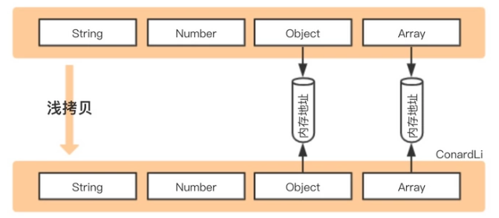
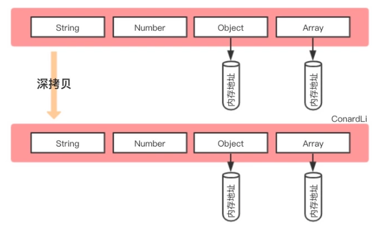

# 深入浅出：JavaScript浅拷贝与深拷贝 

## 1.前言
假如你有一本宝藏秘籍书，并且书中囊括对其引用的全部文献书籍，在书中的附件位置。有朋友来找你借书，为了保护书籍，换了一个书名就直接借给了朋友（引用类型赋值）。后来朋友在书中写写画画，对你这本宝藏秘籍书产生了影响。再下次其他朋友来借书，你准备复印一份书中的全部知识，除了没复印书中引用的更深层的文献，如果全部复印完消耗太多时间和精力，直接将附件文献借给朋友了（浅拷贝）。有个朋友精读书籍，读到了更深层次的附件，结果对附件写写画画。最后你忍无可忍，将书籍和附件文献全部复印了出来，以供朋友们解读，从此自己的宝藏秘籍书不再受影响（深拷贝）。

## 2.详解
- 引用类型赋值：直接将对象赋值到一个新的变量
- 浅拷贝：创建一个新的对象，**只拷贝一层属性数据**到新的对象上，原对象中存在引用类型，会与原对象中的引用类型共享内存地址

  

- 深拷贝：创建一个新的对象，**无限层拷贝属性数据**到新的对象上，新对象是一个完全独立的对象

  

## 3.适用场景
浅拷贝和深拷贝都复制了值和地址，都是为了解决引用类型赋值后互相影响的问题，所以我们不会让引用类型直接赋值。
```
const obj = {a: 1,b:2}
const newObj = obj
newObj.a = 3
console.log(newObj,obj) //{a: 3,b:2} {a: 3,b:2} 
```
### 3.1.浅拷贝适用场景

浅拷贝一般适用于数据类型简单的情况，比如全部都是基本类型的值，既能快速高效复制原数据，修改拷贝对象原对象也不会受影响，又可以保护原数据。还有根据实际情况，在对象之间需要共享状态方法之类的，那么也可以使用浅拷贝。

### 3.2.深拷贝适用场景

深拷贝一般适用于需要与原对象完全没有关系，深拷贝的对象完全独立，修改拷贝对象，原对象一点都不会受影响。

## 4.优缺点
### 4.1.浅拷贝优缺点
- 浅拷贝的优点
    - 节省内存，对于需要共享的对象和方法，不需要在开辟新的堆内存，可以直接共享使用
    - 简单易用，实现浅拷贝有很多原生方法已经支持，Object.assign({},obj)、扩展运算符等等
    - 性能较高，相对于深拷贝来说，对于基本数据类型和简单的数据结构，浅拷贝性能更加
- 浅拷贝的缺点
    - 无意中更改拷贝对象中引用类型的值，原始对象的引用类型的值也会受影响

### 4.2.深拷贝优缺点

- 深拷贝的优点
    - 使得拷贝对象完全独立，不会影响原对象
- 深拷贝的缺点
    - 对于嵌套结构复杂的对象，性能开销会比较大

## 5.代码实现

### 5.1.实现浅拷贝

1. 支持对象和数组两种类型
对进行浅克隆的值，只能是对象和数组，需要进行数据类型判断

2. 对数组类型的数据进行处理

- 扩展符号...
```
const res = [...arr]
```
- slice方法
```
const res = arr.slice()
```
- concat方法
```
const res = arr.concat()
```
- for...of遍历
```
const res = []

for(const value of arr){
    res.push(value)
}
```

3. 对对象类型的数据进行处理
- 扩展符号...
```
const res = [...obj]
```
- Object.assign
```
const res = Object.assign({},obj)
```
- for...of遍历

```
const res = {}

for(const [key,value] of Object.entries(obj)){
    res[key] = value
}
```
4. 代码方法实现
```
//使用扩展运算符
const cloneShallowly = (o) => {
    //数据类型判断
    if(!(o instanceof Object)) return 

    if(Array.isArray(o)){
        return [...o]
    } else {
        return {...o}
    }
}

```

```
//使用各自的方法
const cloneShallowly = (o) => {
    //数据类型判断
    if(!(o instanceof Object)) return 

    if(Array.isArray(o)){
        return o.slice()
    } else {
        return Object.assign({},o)
    }
}

```

```
//使用for...of方法
const cloneShallowly = (o) => {
    //数据类型判断
    if(!(o instanceof Object)) return 

     const res = Array.isArray(o)?[]:{}

     for(const [key,value] of Object.entries(o)){
        res[key] = value
    }

    return res
    
}

```

5. 测试验证
```
const obj = {a: 1, b: {c: 2}}
const newObj = cloneShallowly(obj)
newObj.b.c = 3
//改变newObj中的 b 属性，原 obj 中的 b 属性也会被改变
console.log(newObj,obj) //{a: 1, b: {c: 3}} {a: 1, b: {c: 3}}


const arr = [1, [2, 3]] 
const newArr = cloneShallowly(arr)
newArr[1][0] = 4
//改变 newArr 中的嵌套数组的值，原 arr的嵌套数组也会发生改变
console.log(newArr,arr) //[1, [4, 3]]  [1, [4, 3]] 
```
### 5.2.实现深拷贝（简易版）

1. 一行代码实现深拷贝

适用于日常开发中深拷贝一些简单的对象
```
const obj = {a: 1, b: {c: 2}};
const newObj = JSON.parse(JSON.stringify(obj))
```
这种方式也会存在一些问题：

- 会忽略undefined、symbol和函数
```
const obj = {
  a: undefined,
  b: Symbol('b'),
  c: function () {}
}

const newObj = JSON.parse(JSON.stringify(obj))

console.log(newObj) // {} 

```

- NaN、Infinity、-Infinity 会被序列化为 null
```
const obj = {
  a: NaN,
  b: Infinity,
  c: -Infinity
}

const newObj = JSON.parse(JSON.stringify(obj))

console.log(newObj)  // {a: null,b:null, c: null}
```
- 不能解决循环引用的问题
```
const obj = {
  a: 1
}

obj.obj = obj

const newObj = JSON.parse(JSON.stringify(obj)) // 报错
```

2. 手动实现简易版深拷贝

    简易版：不考虑循环引用和特殊类型

```
const cloneDeeply = (o) => {

    if(!(o instanceof Object)) return o;

    const res = Array.isArray(o) ? [] : {}

    for(const [key,value] of Object.entries(o)){
        res[key] = cloneDeeply(value)
    }

    return res;

}
const obj = {a: 1, b: {c: 2}};
const newObj = cloneDeeply(obj)
newObj.b.c = "更改以后的";
console.log(newObj,obj); // { a: 1, b: { c: '更改以后的' } } { a: 1, b: { c: 2 } }


const arr = [1, [2, 3]] 
const newArr = cloneDeeply(arr)
newArr[1][0] = "更改以后的";
console.log(newArr,arr); // [ 1, [ '更改以后的', 3 ] ] [ 1, [ 2, 3 ] ]
```

## 6.总结

|        | 与原始数据是否指向同一地址 | 基本数据类型 | 嵌套引用类型 |
| :----- | :--: | :---------: | :---------: |
| 引用类型赋值 |  是  | 修改值影响原始数据 | 修改值影响原始数据 |
| 浅拷贝      |  否  | 修改值不影响原始数据 | 修改值影响原始数据 |
| 深拷贝      |  否  | 修改值不影响原始数据 | 修改值不影响原始数据 |

所以选择拷贝方式的时候：
- 如果对象的结构简单，浅拷贝性能更好
- 如果是复杂的嵌套对象又要求完全独立，那么使用深拷贝更安全