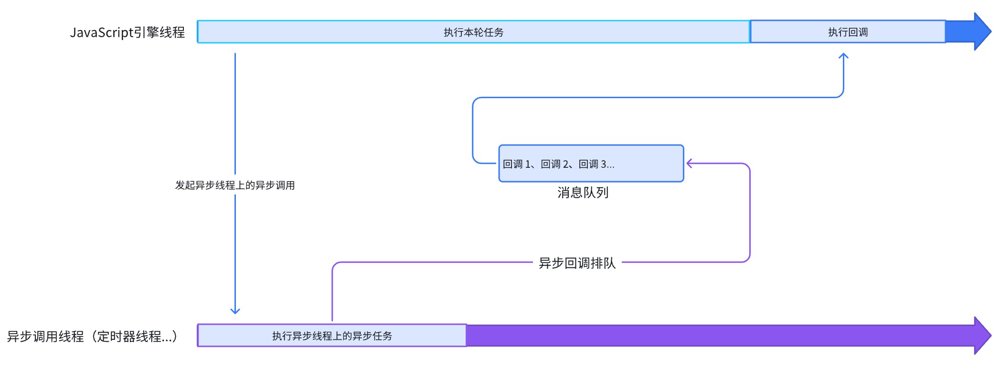
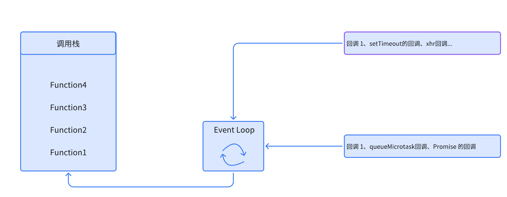

# 深入浅出：JavaScript异步编程详解
## 1.前言
Javascript 由最初的设计初衷，设计为单线程模式，单线程模式指的是在 JS执行环境中只有一个线程去执行代码，那如果遇到耗时任务，就会导致代码执行堵塞，那js为了解决这种等待耗时任务结束才能继续执行下一个任务代码的问题，js 将执行任务的模式分成了两种，一种是同步模式，一种是异步模式，下面就会重点讲解异步模式。
## 2.同步模式和异步模式
### 2.1 同步模式
同步模式指的是前一个任务执行完成，下一个任务才开始执行，按照编写代码的调用顺序依次执行
### 2.2 异步模式
异步模式指的是不会等待前一个任务执行结束，就会立即执行下一个任务。其中在异步任务中，任务又分为宏任务和微任务

1. **宏任务**

- 宏任务是优先级比较低的任务，耗时比较长或由浏览器参与操作的任务。每次事件循环只会执行一个宏任务，在执行完一个宏任务，会立即清空当前所有的微任务，再继续执行下一个宏任务。

- 常见宏任务的类型：`setTimeout` 等定时器的回调、
`XMLHttpRequest`等网络请求的的回调、`DOM`事件的回调

2. **微任务**

 - 微任务是优先级比较高的任务，需要快速立即执行的任务。微任务在当前宏任务执行完毕后回立即清空，即使再此期间产生新的微任务，会加入当前微任务的队列的尾部，与所有的微任务一起执行，不会推迟到下一个宏任务。

 - 微任务是由 javascript 引擎发起和执行的，javascript 引擎与浏览器渲染线程是互斥的，所以在执行微任务期间，在浏览器运行环境中，页面不会发生渲染。

 - 常见微任务的类型：`Promsie`的回调、`await`关键字后面的代码、`queueMicrotask`的回调、`process.nextTick`NOdeJs环境，优先级高于其微任务

## 3.事件循环的理解
### 3.1 事件循环机制的概念
事件循环机制是 javascript实现异步编程的核心机制，由于 javascript 是单线程，它实现了非阻塞的异步行为，它是由调用栈、消息队列、宏任务和微任务组成。事件循环工作流程是：（因为 script 脚本也属于一个宏任务，所以首先触发执行的是一个宏任务）
- 先触发一个宏任务
- 执行同步代码，加入调用栈
- 遇到异步任务，宏任务加入宏任务队列、微任务加入微任务队列
- 当调用栈为空时，先清空微任务队列中的所有任务，在根据宏任务优先级执行下一个宏任务
- 继续重复以上流程

## 4.实现异步编程的几种方法 
- 回调函数：是所有异步编程方案的根基，缺点是多个回调函数嵌套造成回调地域的问题
- Promise：是一种更优的异步编程的统一方案，Promise就是为了解决这个多个回调函数嵌套调用造成的问题，Promise 的支持链式调用。
- Generator：虽然 Promise支持链式调用的写法了，但是 Generator支持同步代码写法
- async/await：是Generator和 Promise 函数的结合之后的语法糖，结合了 Promise是可靠性，也同样跟Generator函数一样支持同步代码线性写法

## 5. 总结
这篇文章主要讲解了javascript 引擎是单线程的，为解决单线程执行代码阻塞问题，提出异步编程，使用事件循环机制使得异步任务高效有条理运行。后面根据异步编程又有主流这四种实现方案，各个方案都有自己的优缺点和适用场景。下面的文章开始Promise、Generator、async/await的详解，以及手撕代码