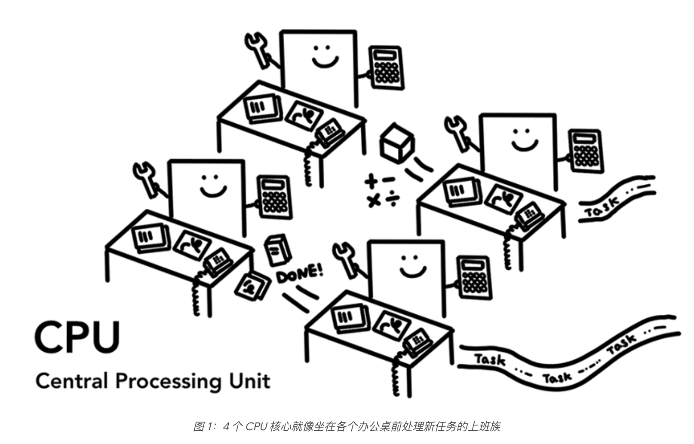
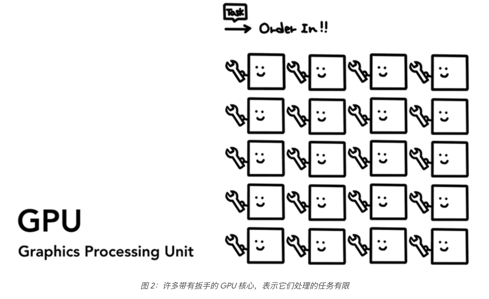
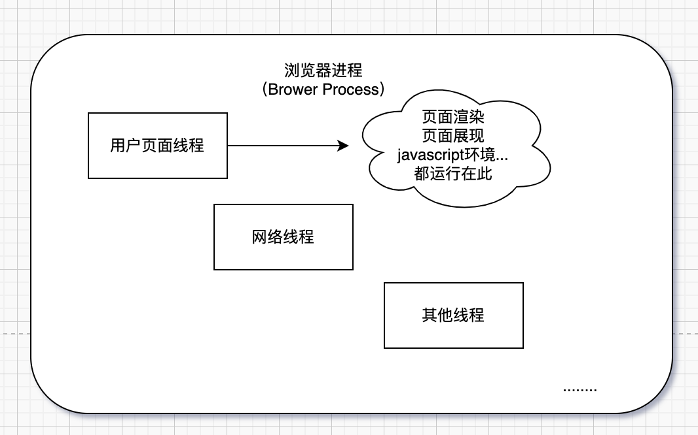
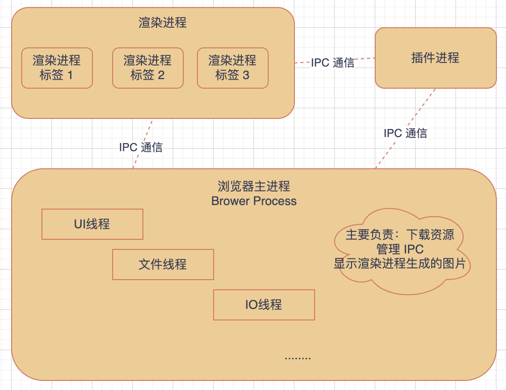
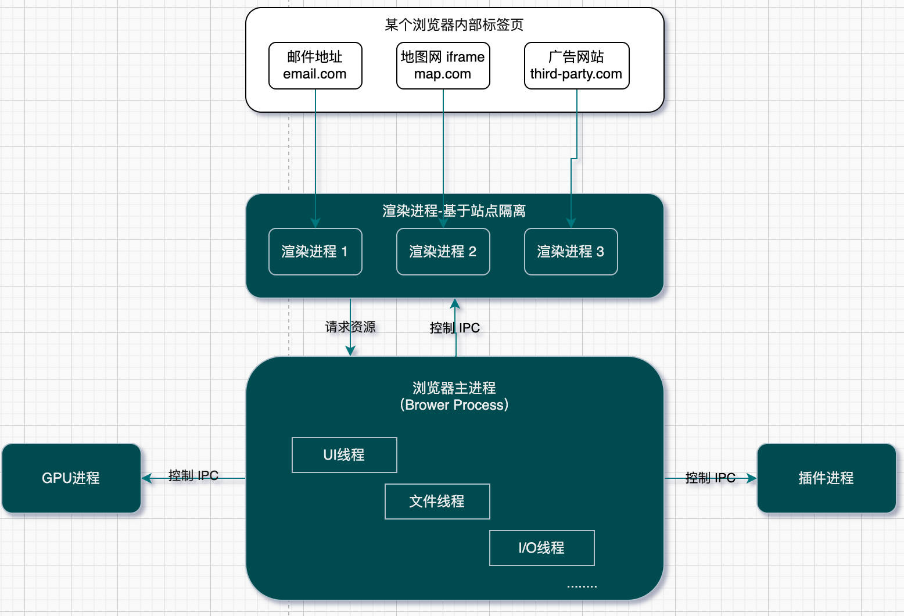
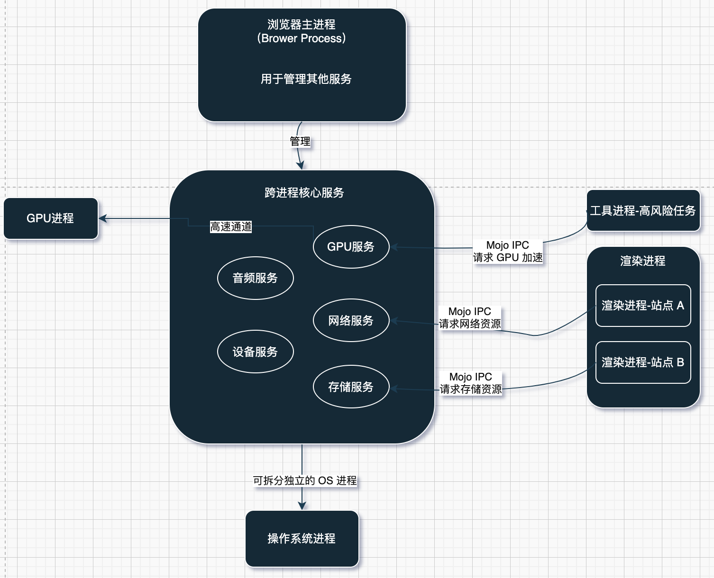

# 浏览器架构详解

## 1.前言
理解浏览器工作原理，我们可以先宏观其次微观的角度去学习，了解浏览器大体架构，再从架构中的某一层重点去学习。比如说我们经常讨论到的页面的渲染机制，我们可能就需要去看浏览器渲染进程这方面的知识，那我们发现原来浏览器这么多进程，为啥要设计多进程的呢，单进程多线程满足不了功能么，有什么缺陷么？早期的浏览器确实是单进程的，那现在演进成什么样的架构了，每次架构的改变到底是为什么？所以我们带着问题去学习思考，让我们来解开这层神秘的面纱。
## 2.敲黑板，补基础
当当当！前言我们提到单进程多线程等基础知识，我们现在来补一下基础
### 2.1 CPU与GPU
- **CPU是计算机的中央处理器**，是计算机的大脑，设计为通用、高效处理串行任务。CPU核心数量一般 4-64 核心，但每个核心的处理任务能力强，缓存大，适合处理逻辑复杂的任务。比如系统调度、软件运行等

- **GPU是计算机的图形处理单元**，设计为专注多个并行任务，一般核心数量极多，数千数万级别的流处理器，每个核心轻量化，擅于重复计算，适合处理数量大，相对独立的任务。比如处理图像数百万个像素的颜色等。现在随着 AI 的兴起，GPU 也拓展应用到通用计算（AI、大数据等），利用它并行处理任务的特点应用到非图形领域，成为现在这些领域的算力核心

- 在计算机和手机上启动应用的时候，应用会在操作系统的机制作用下在 CPU 和 GPU 上运行
### 2.2 进程
**进程其实就是一个正在运行的程序实例**。当启动一个程序应用时，操作系统会分配一块私有内存供进程使用，进程之间的内容也是相互隔离的。当关闭应用时，进程消失，内存也会被操作系统释放出来。进程可以请求操作系统创建一个新的进程来执行其他的任务，那操作系统会进程分配新的内存。如果两个进程需要通信，就会需用**进程间通信IPC**来通信。
### 2.3 线程
**线程**是运行在进程中的一个任务，运行进程至少需要一个主线程。

### 2.4 进程与线程的关系
1. 线程是依赖进程进行启动和管理的
2. 进程中的一个线程出错，那么会导致整个进程崩溃
3. 线程之间共享进程中的数据
## 3.回正题，浏览器架构发展史

### 3.1 早期单进程时代
在 2008年之前，所用的功能模块（用户页面、渲染引擎、JavaScript 引擎等）都在一个进程里面，那这就是单进程时代的浏览器。

早期单进程浏览器也有它的优点：
1. 简单易维护：架构简单，容易代码维护
2. 资源开销低：因为只有一个进程，那没有进程间的通信，内存占用低  

其实最主要的是它的缺点，如此多的功能模块运行在一个进程中，会带来一一些问题：
1. **不稳定**：任意一个线程出错，都会导致浏览器崩溃。在早期浏览器播放视频都会借助插件，插件是一个不稳定因素，还有在渲染引擎，如果遇到复杂的 js代码也会导致线程出错，从而导致浏览器崩溃
2. **不安全**：网站上的恶意脚本或者插件可以无限制的获取系统操作权限，操作系统资源
3. **响应慢**：许多任务共享一个线程，例如 js 代码复杂运行时间长，会导致页面渲染不流畅导致卡死的现象。

### 3.2 多进程时代

### 3.3 多站点隔离时代

### 3.4 面向服务架构

## 4.总结
